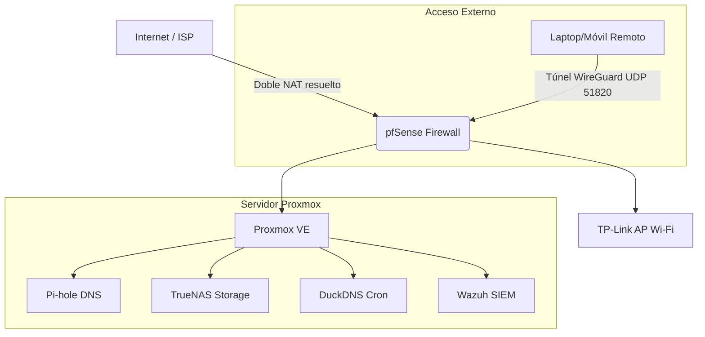

# Enterprise-Grade HomeLab: Arquitectura de Seguridad y Nube Privada

## Resumen del Proyecto
Diseño, despliegue y administración de una infraestructura de nube privada orientada a la seguridad (**Security-First**). Este entorno simula una arquitectura empresarial escalable, implementando segmentación de red, almacenamiento seguro, acceso remoto cifrado y monitoreo continuo.

## Objetivos
* **Resiliencia:** Construir una infraestructura de alta disponibilidad basada en un hipervisor tipo 1.
* **Seguridad:** Implementar seguridad perimetral y políticas de enrutamiento estrictas.
* **Gestión de Datos:** Centralizar la identidad, control de acceso (ACLs) y almacenamiento masivo.
* **Laboratorio:** Desarrollar un entorno seguro para prácticas de Blue Teaming (SIEM) y Red Teaming (Pentesting).

## Stack Tecnológico (Tech Stack)

* **Virtualización y Cómputo:** Proxmox VE, Contenedores LXC, VMs.
* **Redes y Seguridad Perimetral:** pfSense (Firewall/Router), WireGuard (VPN), Pi-hole (DNS Sinkhole).
* **Almacenamiento y Datos:** TrueNAS (SMB, ZFS), control estricto de ACLs.
* **Acceso y Automatización:** DuckDNS (Cron automatizado), Nginx Proxy Manager (Próximamente).
* **Seguridad Defensiva:** Wazuh SIEM (En despliegue).

## Arquitectura de Red (Topología)

## Fases de Implementación y Logros Técnicos

### Fase 1: Infraestructura y Ruteo Base
* **Despliegue de Proxmox VE:** Configuración sobre hardware compacto (HP EliteDesk), optimizando recursos mediante el uso de contenedores ligeros (LXC) frente a máquinas virtuales completas.
* **Resolución de Ruteo Interno:** Diagnóstico y corrección de conflictos por múltiples *Default Gateways* en el bridge de Linux, asegurando la conectividad del hipervisor a través del firewall.

### Fase 2: Perímetro y Control de Acceso
* **Implementación de pfSense:** Establecido como núcleo de enrutamiento, delegando el hardware comercial (TP-Link) exclusivamente a funciones de Access Point.
* **Doble NAT y Port Forwarding:** Superación de bloqueos de tráfico mediante el reenvío de puertos UDP 51820, permitiendo túneles VPN estables.
* **Automatización DDNS:** Implementación de script `cron` y API de DuckDNS para actualización automática de IP dinámica, garantizando la persistencia del acceso remoto.

### Fase 3: Gestión Segura de Datos (Storage)
* **Optimización de Recursos:** Desmantelamiento de servicios monolíticos (Nextcloud) a favor de protocolos de transferencia nativos para liberar CPU y RAM.
* **Mínimo Privilegio:** Migración de datasets y configuración de recursos compartidos SMB protegidos por credenciales únicas e integridad de permisos ACL recursivos.

### Fase 4: Monitoreo y Próximos Pasos (Roadmap)
* **[En Progreso] Observabilidad:** Implementación de agentes Wazuh para recolección de logs de firewall y *File Integrity Monitoring* en el NAS.
* **[En Progreso] Reverse Proxy:** Despliegue de Nginx Proxy Manager con certificados SSL para acceso web seguro sin exposición de puertos.
* **[Futuro] Segmentación:** Creación de VLANs 802.1Q para aislar el tráfico de IoT, red personal y laboratorios de pentesting.

---

## Sobre el Autor
**Estudiante de Ingeniería en Sistemas Computacionales**
Apasionado por la arquitectura en la nube y la ciberseguridad.

* **Certificación:** Google Cybersecurity Professional Certificate (Octubre 2025).
